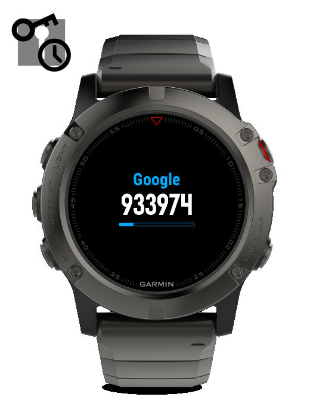

TOTP (Garmin ConnectIQ) Widget
==============================
TOTP (RFC6238) implementation for Garmin ConnectIQ devices
(REQUIRES CIQ 3.x OR ABOVE)

   

TOTP is a Garmin ConnectIQ Widget that displays:
 - the TOTP authentication code
 - for up to 100 user's configurable accounts
 - using Garmin devices *native* cryptographic functions
   (REQUIRES CIQ 3.x OR ABOVE)

Each account is fully configurable, including:
 - name
 - secret key
 - secret key encoding (Hex, Base32 or Base64)
 - digits to display (from 6 to 10)
 - hash algorithm (SHA1 or SHA256)
 - time base (T0)
 - time step (TX)

Build, Installation and Usage
-----------------------------

Please refer to the INSTALL and USAGE files.
